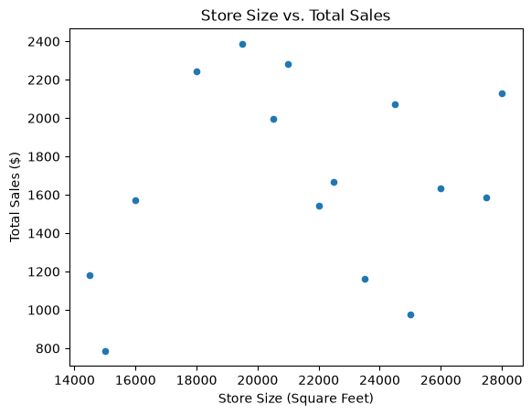
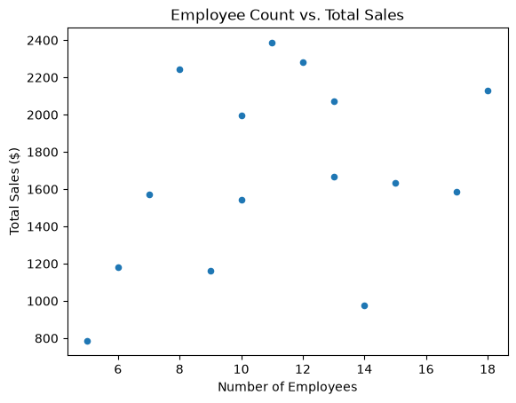

# Project Documentation

This project explores factors related to store sales performance using relational retail data, SQL, SQLite, pandas, and Python.

The analysis compares sales across stores and examines whether store size and employee count are related to total sales. It also compares sales per employee to account for differences in staffing between stores.

## Professional Workflow

See [**Workflow B: Apply Example Project**](https://denisecase.github.io/pro-analytics-02/workflow-b-apply-example-project/)
to get a project like this running on your machine.

## Documentation Index

- **Home** - this landing page
- [**Project Instructions**](./project-instructions.md)
- [**Concepts**](./concepts.md)
- [**Data Card**](./data-card.md)
- [**API**](./api.md)

## Results

### Store Size vs. Total Sales

The correlation between store size and total sales was 0.185, indicating a weak positive relationship. Larger stores did not necessarily have higher total sales.

### Employee Count vs. Total Sales

The correlation between employee count and total sales was 0.335, also indicating a weak positive relationship. This relationship was stronger than the relationship between store size and total sales, but it was still weak.

Sales per employee also varied across stores. Stores with the highest total sales were not always the stores with the highest sales per employee.

## Produced Artifacts

This project produces:

- a SQLite database containing the related retail tables
- SQL query results recorded in `project.log`
- correlation calculations comparing store characteristics with total sales
- scatter plots comparing store size and employee count with total sales
